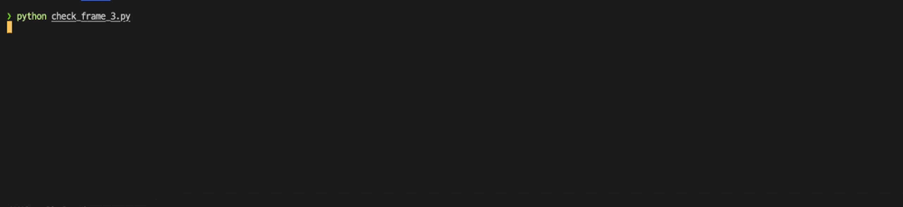

# Parse numeric character from video

## Requirements

```bash
# Install Tesseract
brew install tesseract
# Optional (Language pack)
brew install tesseract-lang 

# Install pytesseract package
pip install pytesseract
```


## Target video


## Step 1


```python
python crop_number_area.py
```

Crop target area

> minimize the noise

## Step 2


```bash
python get_numbers_area.py
```

Get all numbers area

## Step 3



```bash
python parse_number_from_area.py
```

Parse number from all area w/ pytesseract
